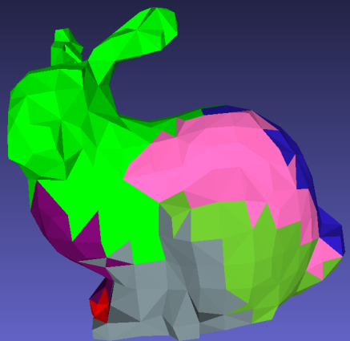

### Mesh segmentation course project

Implementation of Katz, Sagi, and Ayellet Tal. "Hierarchical mesh decomposition using fuzzy clustering and cuts." ACM transactions on graphics (TOG) 22.3 (2003): 954-961. 

Segments input 3D models into different pathes.

#### Usage
You dont need to install any dependencies. To install the package (in dev mode) run:
```bash
cd mesh_segmentation && pip install -e .
```

For basic binary segmentation run:
```python
segment_mesh -i <path_to_ply.ply>
```
It will output a resulted file as "output_decompose.ply"

For multi-patches segmentation (currently ony binary recursive supported):
```python
segment_mesh -i <path_to_ply.ply> -k <num_clusters>
```

For other options (e.g. setting an output dir, num threads):
```python
segment_mesh -h
```

### TODO
- Better fuzzy borders
- Real k-clustering
- Iterartive solver and visualizations from the paper

#### Requirements
- python~=3.9
